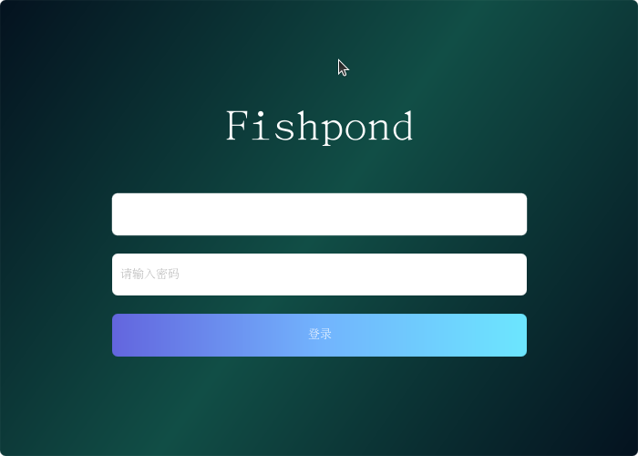
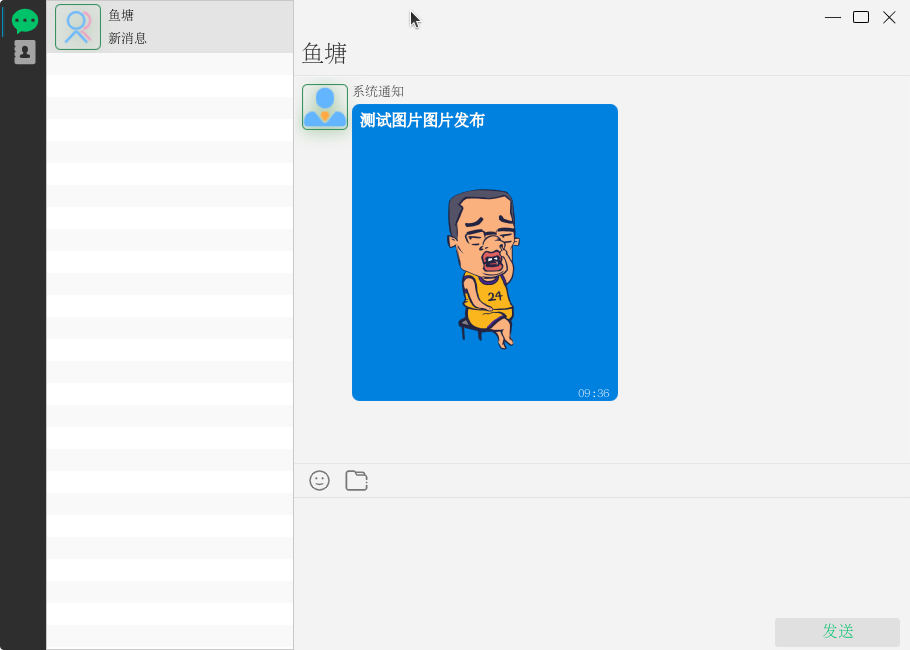

# 鱼塘(fishpond)

> 该软件默认为群聊模式即用户登录成功并成功通过TCP注册，所有用户就属于同一个群里面,每个用户发送的群聊消息，所有用户均可见。
> 一对一单聊目前正在开发中,目前计划用户可以通过上传自定义公钥(可选),一对一聊天时将使用该公钥加密传输。

# 项目结构

```
fishpond
├── core     -- 工具类及通用代码
├── app      -- Javafx实现桌面客户端
├── mapper   -- 数据库相关实体类
├── server   -- 服务端(TCP+HTTP)接口
├── protocol -- 具体协议实现(java版)
├── web      -- Vue实现WEB客户端
└── mobile   -- flutter实现移动客户端
```

# 通讯协议

### 通信格式

字节| 1-3 | 4-5 | 6-7  | 8-11       | 12-15    | 16-47 | 48-49 | 50.... |
---|-----|-----|-------|------------|----------|-------|-------|--------|
内容| FPD | 消息类型| 业务代码 | 用户账号(from) | 用户账号(to) | 消息ID  | 数据长度  | 数据内容   |

* FPD为消息固定标识
* 消息类型,目前仅支持普通文本、json数据、二进制数据,后期可能会有其他扩展，具体请查看[数据类型](./protocol/src/main/java/cn/navclub/fishpond/protocol/enums/MessageT.java)
* 业务代码,当前消息所要执行的操作,具体请查看[业务代码](./protocol/src/main/java/cn/navclub/fishpond/protocol/enums/ServiceCode.java)
* 用户账号,在当前系统中已注册用户系统分配账号。
* 数据长度,占用2个字节，也就是说当前协议最多允许传递64kb数据,大于该数据长度将无法传递。
* 数据内容,具体传输数据

### 具体协议

* 用户登录

URL:/user/login

```json
{
  "username": 752544765,
  "password": "MD5加密字符串"
}
```

* TCP会话注册

业务代码| 消息类型 | from | to |
-------|-------|---|----|
1    | JSON  | 0 | 0  |

```json
{
  "sessionId": "50E0D9BA8B8544BF81977DA847245EC5"
}
```
其中sessionId由用户登录接口返回。

* TCP心跳

业务代码| 消息类型 | from | to |
-------|------|---|----|
  0    | TEXT | 0 | 0  |

* 群聊消息

业务代码| 消息类型 | from | to |
-------|------|---|----|
5    | JSON | 0 | 0  |

* 一对一单聊(开发中)
  
业务代码| 消息类型 | from | to    |
  -------|------|---|-------|
  6    | JSON | 0 | 指定用户账号 |

# 消息结构说明

```json
{
  "timestamp": 16555526684,
  "items": [
    {
      "type": 0,
      "message": "Hello,World!"
    },
    {
      "type": 1,
      "message":"https://t7.baidu.com/it/u=727460147,2222092211&fm=193&f=GIF"
    }
  ]
}
```

> 正如上面看到结构体一样,正常消息包含两个字段`timestamp`和`items`字段。其中`timestamp`为发送消息时的时间戳,`items`为发送消息内容
> 其中`type`为[消息内容](./protocol/src/main/java/cn/navclub/fishpond/protocol/enums/ContentType.java),`message`为具体消息内容
> 客户端收到该消息后可以自己决定如果布局显示。

# 客户端

> 本系统提供一个使用`javafx`实现的客户端,由于没有专业美工及个人审美能力较差,实现的客户端较丑,
> 用户可以通过上面的通讯协议使用熟悉技术实现自己满意的客户端。

## 程序快照




# Q&A
* FROM和TO如何确定
> FROM为发送信息用户账号，TO为接收信息用户账号。FROM字段用户在发送消息时可以以0填充,实际消息通过TCP服务器时由服务器来确定该值,
> TO必须指定为特定用户账号,这里有个特例系统账户为0,因此如果TO为0则是将消息发送给服务器。